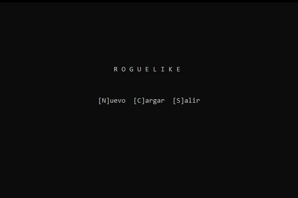
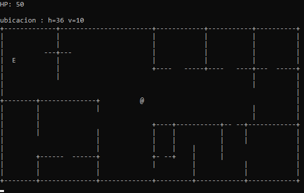
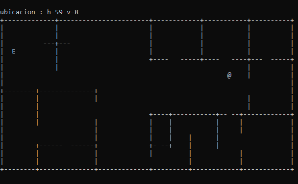

# roguelike-old-project

So... what is this? I'ts just something I wronte on C++ while learning just for fun. This is the first programming language I have chosen to learn, but with very basic tutorials. As I was new in the programming world, I had no idea where to look info and even what words should I use to search in the internet.

This is a pretty basic project. When you launch the program, it will show 3 options (these are on spanish):

[N]ew - [L]oad - [E]xit

Pressing the first letter will chose the option.

There's also a `txt` file needed to run the game. Why? Because I used it to store the map design and the player start position.

- New game will read the `txt` file and store it in a new array, then find where the `@` (player) is and store it's coordinates.

- Load will "load" a previously saved game. The program had an option to dump the map array (including the `@` and others) to another txt file. The program does the same as new game.

- Exit will just exit the game, with a silly "animation".

This is how the game looks:

The flickering look is because the text in the console is being redrawn every time the player moves. If there's a free space, the `@` and the space will swap places and then redraw the modified array. If there's a wall or anything else, nothing will happen, and the screen won't redraw again.

So... that's it! I just wanted to make a backup here in my personal GitHub account. The code is not great and the "game" is a barely functional prototype, but I made it in a self-taught way with the bare basics I learned from a guy's videos that names everything in spanish (this guy called "tuplas" the arrays), making it really hard to find any info in the internet.

Why did I abandoned `C++`? Don't get me wrong, I still think this is the best language I used to write anything (next to `C#`), no matter how little I knew about it. The problem was that I didn't know what to do with this knowledge. Trying to understand the more advanced stuff from the same guy that changes the name of everything was getting harder and I didn't want to start again learning from scratch, so I moved to `C#`. With `C#` it was the same situation: not knowing what to do with this knowledge.

Today I'm learning `JavaScript` (and `HTML` + `CSS`) and I can finally know what I want to do: web development, frontend and then backend, so this is what I'm learning today.

